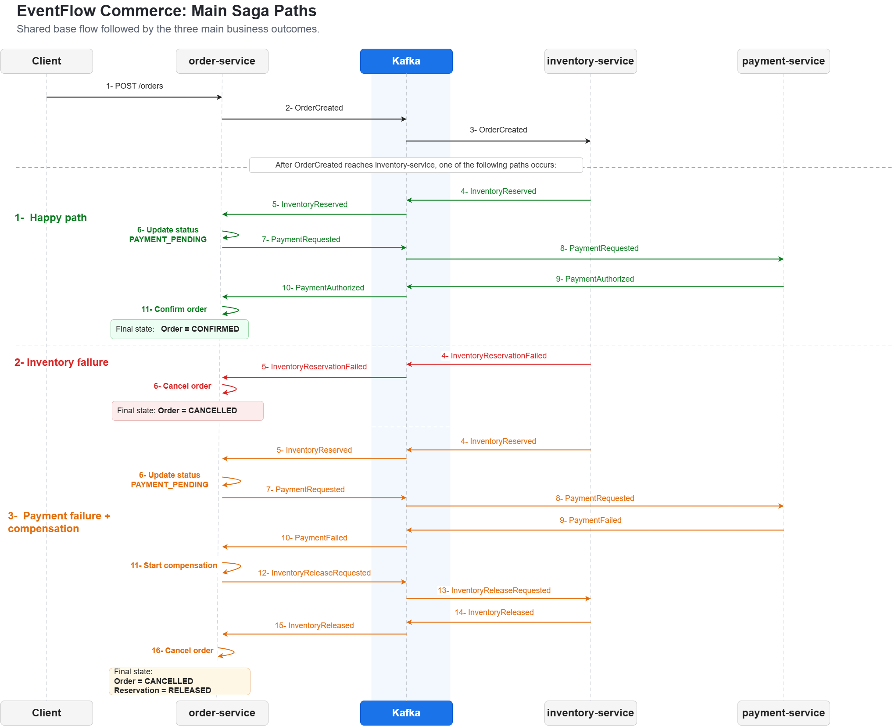
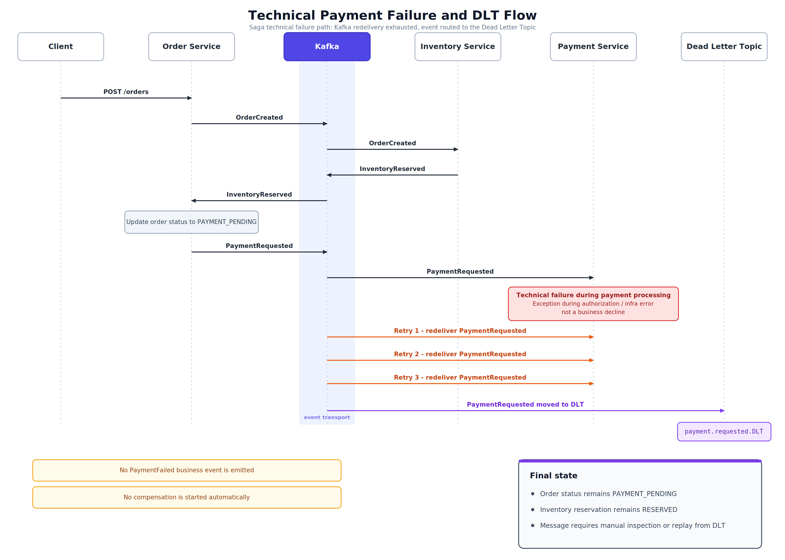

<div align="center">

# EventFlow Commerce: Outbox Saga


</div>

A Spring Boot microservices project that implements the **order processing part** of an ecommerce system. It demonstrates reliable event driven coordination between `order-service`, `inventory-service`, and `payment-service` using Kafka, PostgreSQL, Transactional Outbox, Saga Choreography, Compensation, Idempotency, correlation logging, and metrics.

This is not a full ecommerce platform. It focuses on backend reliability patterns used when independent services must coordinate work without distributed transactions.

---

## What this project demonstrates

This project is intentionally small, but it focuses on backend reliability patterns that are common in real distributed systems.

Covered patterns and engineering concerns:

**Reliability patterns**
```text
Transactional outbox
Outbox row claiming with "FOR UPDATE SKIP LOCKED"
Saga choreography
Compensation
Idempotent consumers
Idempotent order creation with "requestId"
Database per service
Eventual consistency
Pessimistic locking for inventory reservation
Retry and DLT handling
```
**Operational concerns**
```text
Kafka-based event communication
Kafka topic pre-creation in Docker Compose
Kafka producer idempotency configuration
Event Envelope with eventVersion, correlationId, causationId, source, and payload
Correlation logging with MDC
Actuator and Micrometer metrics
Structured API error handling
Docker Compose-based local environment
HTTP-based scenario testing
```

## What this project is not

- A full ecommerce platform (no cart, catalog, pricing, authentication/authorization, or API gateway)
- A real payment integration (payment is simulated with deterministic test UUIDs)
- A production deployment (no TLS, no schema registry, no Kubernetes, no Grafana)
- An OpenTelemetry or distributed tracing demo (correlation IDs are present in logs, but no trace backend)

---

## Services

### Application modules:

| Service | Port | Database | Responsibility |
| --- | ---: | --- | --- |
| `order-service` | `8081` | `orderdb` on `5433` | Accepts order requests, owns order state, coordinates the saga, and triggers compensation |
| `inventory-service` | `8082` | `inventorydb` on `5434` | Reserves stock, rejects unavailable inventory, and releases reservations during compensation |
| `payment-service` | `8083` | `paymentdb` on `5435` | Simulates payment authorization, business failure, and technical failure |
| `event-contracts` | n/a | n/a | Shared event envelope and payload contracts |

### Local infrastructure:

| Service | Port | Database | Responsibility                                                                                       |
| --- | ---: | --- |------------------------------------------------------------------------------------------------------|
| `order-db` | `5433` | `orderdb` | PostgreSQL database owned by `order-service`                                                         |
| `inventory-db` | `5434` | `inventorydb` | PostgreSQL database owned by `inventory-service`                                                     |
| `payment-db` | `5435` | `paymentdb` | PostgreSQL database owned by `payment-service`                                                       |
| `kafka` | `9094` | n/a | Kafka broker used for event transport                                                                |
| `kafka-init` | n/a | n/a | One-time init container that pre-creates application and DLT topics before the services start |
| `kafka-ui` | `8085` | n/a | Local topic and message browser                                                                      |

The business flow starts only through `order-service`. It acts as the practical coordinator of the saga because it owns the order state. It does not use a central orchestration engine. Instead, it reacts to inventory and payment events, updates order status, and emits the next command event when needed.
 
Order creation accepts a trusted checkout snapshot produced upstream. Pricing is already calculated before the request reaches `order-service`.
`inventory-service` and `payment-service` do not expose public business APIs in this demo. They react to Kafka events. 
`inventory-service` listens for order events, locks stock pessimistically, reserves or fails, and publishes its result. On compensation, it releases reservations and increments stock.
`payment-service` also listens for payment requests, runs a fake authorizer, and publishes either success or failure events.
Each of these three services owns its own PostgreSQL database.

`kafka-init` is not a long-running application service. It runs once after kafka becomes healthy, creates the required application topics and DLT topics, and then exits. 
The three business services depend on it, so they start only after the required Kafka topics exist.

Created topics are:

| Topic | Direction |
| --- | --- |
| `order.created` | Order → Inventory |
| `inventory.reserved` | Inventory → Order |
| `inventory.reservation.failed` | Inventory → Order |
| `payment.requested` | Order → Payment |
| `payment.authorized` | Payment → Order |
| `payment.failed` | Payment → Order |
| `inventory.release.requested` | Order → Inventory |
| `inventory.released` | Inventory → Order |

Topic names are stable. Event versioning is handled through `eventVersion` inside the event envelope.

DLT topics follow this pattern: `{topic}.DLT`

---
## Technology stack

```text
Java 17
Spring Boot 3.x
Spring Data JPA
PostgreSQL
Flyway
Apache Kafka in KRaft mode
Spring Kafka
Maven multi module build
Docker Compose
Micrometer and Spring Boot Actuator
Kafka UI
GitHub Actions
```
---

## Architecture style

The services use a **Clean Architecture inspired** structure. The code separates API models, application use cases, domain model, messaging, observability, and outbox persistence.

It is not a strict Clean Architecture implementation because the domain entities still use JPA annotations. That is intentional for this project. The goal is to keep the code simple while preserving clear boundaries between the main concerns.

Example structure from `order-service`:

```text
com.shirin.order
├── api
├── application
├── domain
├── idempotency
├── messaging
│   └── consumer
├── observability
└── outbox
```
Some infrastructure patterns are implemented per service on purpose. This keeps service ownership explicit and avoids coupling services through a shared persistence framework. In a larger production system, selected pieces could be extracted into internal support libraries, such as observability support, event envelope processing, and outbox support.

## Main saga flows

The business flow starts when `order-service` receives `POST /orders`, stores the order, and writes `OrderCreated` to its outbox in the same database transaction. The outbox publisher later publishes the event to Kafka.

After `OrderCreated` reaches `inventory-service`, one of these paths occurs:

1. **Happy path**  
 ```text
   OrderCreated -> InventoryReserved -> PaymentRequested -> PaymentAuthorized  => order status = CONFIRMED
```

2. **Inventory failure**  
   Inventory cannot be reserved because stock is insufficient or the SKU is invalid.
```text
   OrderCreated -> InventoryReservationFailed => order status = CANCELLED (No compensation needed)
```

3. **Payment business failure with compensation**  
   Inventory is reserved, but payment fails as a business decision. The order moves to `CANCELLATION_PENDING`, inventory release is requested, and after `InventoryReleased`, the order becomes `CANCELLED`.
```text
   OrderCreated -> InventoryReserved -> PaymentRequested -> PaymentFailed -> InventoryReleaseRequested -> InventoryReleased
   => order status = CANCELLED and inventory reservation status = RELEASED
```
   


<p align="center">
  
</p>


4. **Payment technical failure**

   A technical payment failure is handled differently from a business decline. If payment processing throws a technical exception, no `PaymentFailed` business event is produced. The Kafka consumer retries the message and eventually sends it to DLT if retries are exhausted. No compensation is started automatically because the system does not know whether the payment was actually declined.

```text
   OrderCreated -> InventoryReserved -> PaymentRequested -> payment-service throws technical failure -> retry -> DLT
    => order status remains PAYMENT_PENDING and inventory reservation remains RESERVED until the failed message is inspected or replayed
```


<p align="center">
  
</p>


---

## Event envelope

Every Kafka message is wrapped in a shared envelope. Key fields:

| Field | Purpose |
| --- | --- |
| `eventId` | Unique event identifier used for idempotent consumers |
| `eventType` | Logical event name |
| `eventVersion` | Contract version |
| `correlationId` | Shared identifier across the whole saga |
| `causationId` | The event ID that caused the current event |
| `source` | Publishing service |
| `occurredAt` | Event creation timestamp |
| `payload` | Business data |

The payload carries business data. The envelope carries metadata for tracing, correlation, versioning, and causal chain analysis.

Event versioning is carried inside the event envelope through `eventVersion`. In a larger system, versioning would normally be standardized through a schema registry and compatibility policy.

`correlationId` comes from the original HTTP request, or is generated by `order-service` if `X-Correlation-Id` is missing.

`causationId` is normally the `eventId` of the event that triggered the current event. The first event in a saga, `OrderCreated`, has no previous event, so its `causationId` is `null`.

---
## Core implementation choices

### Transactional Outbox 

Each service stores its business data and outgoing events in the same local database transaction. 

```text
begin transaction
    save business record
    save outbox event
commit transaction
```
This guarantees that if business data is committed, the corresponding outbox event is also committed. If the transaction rolls back, both the business record and the outbox event roll back.

This avoids the failure case where a service commits a database change but crashes before publishing the event. A scheduled outbox publisher later claims publishable rows, publishes them to Kafka, and marks them. 

### Outbox row claiming and competing workers

**Outbox event states**

| Status | Meaning                                                                              |
| --- |--------------------------------------------------------------------------------------|
| `PENDING` | Event has been created but not published yet                                         |
| `PROCESSING` | Event is claimed by a publisher instance |
| `PUBLISHED` | Kafka acknowledged the event                                                         |
| `FAILED` | Previous publish attempt failed, but the event can be retried                                |
| `DEAD` | Retry limit was reached and the event will not be retried automatically              |

Each service has an outbox publisher. The publisher first claims eligible rows through PostgreSQL row locking using `SELECT ... FOR UPDATE SKIP LOCKED`, marks them as `PROCESSING`, and only then publishes them to Kafka.

Marking claimed rows as PROCESSING prevents two running instances of the same service from publishing the same outbox row at the same time.

If Kafka acknowledges the message, the outbox row is marked as `PUBLISHED`. But if Kafka is unavailable, slow, or the send operation fails, the event is marked as `FAILED` or `DEAD` depending on the retry count.

If the service crashes after kafka acknowledges the message but before the row is marked as `PUBLISHED`, the event may be published again. Consumers are therefore idempotent.

A recovery job resets stale `PROCESSING` events back to `FAILED`, so a service crash after claiming rows does not leave events stuck forever.

The outbox publisher provides **at least once** publishing semantics.

### Kafka producer durability

Kafka producer idempotency settings are configured for the services. `acks=all` is used so the publisher waits for broker acknowledgement. Producer idempotency reduces duplicate records caused by producer retries.

End to end correctness still relies on the combination of Transactional Outbox and idempotent consumers. The project does not claim exactly once delivery across the full distributed workflow.

### Idempotent consumers 

Each consumer has a `processed_events` table to avoid applying the same incoming event more than once.

```text
insert eventId into processed_events
if insert succeeds -> process event
if insert does not insert because eventId already exists -> ignore duplicate
```

This handles Kafka redelivery and duplicate outbox publication.

### Idempotent order creation

The create order API (`POST /orders`) uses `requestId` as an idempotency key. The `orders` table has a unique constraint on `request_id`. If the same request is submitted again:

```text
No new order is created
No new OrderCreated event is stored
The service returns the existing order instead of creating a duplicate
Response indicates duplicate = true
```

### Inventory locking 

Inventory rows are locked during reservation and release. The service groups duplicate SKU lines, sums quantities, sorts SKU IDs, and locks rows in a stable order. This reduces deadlock risk and prevents overselling under concurrent order processing.

### Retry and DLT handling

Kafka consumers retry transient failures. Non retryable errors, such as invalid event payloads or validation errors, are sent to DLT. Broken messages are kept out of the main flow, so they do not block normal processing. Operators can then review them separately and understand what went wrong. 

Technical failures in payment processing are retried and then sent to DLT. They do not trigger compensation because the system does not know whether the payment was declined.

---
## Observability

### Correlation logging

The order API accepts `X-Correlation-Id`. If it is missing, `order-service` generates one. The same correlation ID is propagated through all events.

Each service writes useful context into MDC so logs can be searched by:

```text
correlationId
eventId
eventType
causationId
source
orderId
requestId
```

This makes it possible to trace a full saga with one search. In practice, this means a saga can be followed from the initial API request to the final service outcome by searching for the same correlation ID or order ID in the service logs.

Examples: 

```powershell
docker compose logs order-service inventory-service payment-service | Select-String "<correlation-id>"
docker compose logs order-service inventory-service payment-service | Select-String "<order-id>"
```

### Metrics

The services expose Actuator metrics and Prometheus format endpoints.

```text
/actuator/health
/actuator/metrics
/actuator/prometheus
```

The project uses metrics that answer operational questions.

| Metric | Type | Tag | Values | Purpose |
| --- | --- | --- | --- | --- |
| `order.saga.created` | Counter | n/a | n/a | Orders created |
| `order.saga.confirmed` | Counter | n/a | n/a | Orders confirmed |
| `order.saga.cancelled` | Counter | n/a | n/a | Orders cancelled |
| `order.saga.cancellation.started` | Counter | n/a | n/a | Compensation started after payment failure |
| `order.resolution.duration{outcome}` | Timer | `outcome` | `confirmed`, `cancelled` | Time from order creation to a terminal business state |
| `inventory.reservation{result}` | Counter | `result` | `reserved`, `failed` | Inventory reservation result |
| `inventory.release{result}` | Counter | `result` | `completed` | Inventory release completion |
| `payment.authorization{result}` | Counter | `result` | `authorized`, `failed` | Payment authorization result |
| `outbox.publish{result}` | Counter | `result` | `success`, `failed` | Outbox publish success or failure |
| `outbox.events{status}` | Gauge | `status` | `pending`, `processing`, `published`, `failed`, `dead` | Current number of outbox events by status |

Identifiers such as `orderId`, `eventId`, `correlationId`, `customerId`, and `requestId` are not metric tags. They belong in logs and traces. 

`order.resolution.duration{outcome}` is a timer, so it does not have a single fixed value after the test run. It records how long it takes for an order to reach a terminal business state such as `CONFIRMED` or `CANCELLED`. 

`outbox.events{status}` is a gauge. It reports the current number of outbox rows in each status.


Metric investigation examples:

```powershell
Invoke-RestMethod "http://localhost:8081/actuator/metrics/order.saga.confirmed"
Invoke-RestMethod "http://localhost:8081/actuator/metrics/outbox.publish?tag=result:success"
Invoke-RestMethod "http://localhost:8081/actuator/metrics/outbox.events?tag=status:pending"
Invoke-RestMethod "http://localhost:8081/actuator/metrics/order.resolution.duration?tag=outcome:confirmed"
```

---
## How to run locally

**Prerequisites:** 
- Docker
- Docker Compose
- IntelliJ IDEA or another HTTP client that can run `.http` files

Command examples use `PowerShell` for HTTP checks and log filtering. On Linux or macOS, use `curl` instead of `Invoke-RestMethod` and `grep` instead of `Select-String`.

Start the full system:

```powershell
git clone https://github.com/shirinjamshidiyan/eventflow-commerce-outbox-saga
cd eventflow-commerce-outbox-saga
cp .env.example .env
docker compose up --build -d
```
To reset the databases and rerun the scenarios from a clean state:

```powershell
docker compose down -v
docker compose up --build -d
```

After the containers are running, open Kafka UI if you want to inspect topics and messages:

```text
http://localhost:8085
```

Check that the services are running:

```powershell
Invoke-RestMethod http://localhost:8081/actuator/health
Invoke-RestMethod http://localhost:8082/actuator/health
Invoke-RestMethod http://localhost:8083/actuator/health
```

To run the saga scenarios, open and execute:

```text
order-saga-tests.http
```
The scenario file sends requests only to `order-service`; the other services react through Kafka events.

To follow the logs while testing:

```powershell
docker compose logs --tail=0 -f order-service inventory-service payment-service
```

After running the scenario file, wait a few seconds for asynchronous event processing to finish. Then run:

```text
metrics-check.http
```
This checks the Actuator metrics exposed by all three services.


## Testing the flows

The repository includes HTTP files for manual scenario testing.

```text
order-saga-tests.http
metrics-check.http
```

`order-saga-tests.http` covers 12 order creation scenarios:

| # | Scenario | Coverage |
| ---: | --- | --- |
| 1 | Happy path | Full saga to `CONFIRMED` |
| 2 | Duplicate requestId | Idempotent API |
| 3 | Insufficient stock | Inventory failure and direct cancellation |
| 4 | Unknown SKU | Inventory failure and direct cancellation |
| 5 | Card declined | Payment business failure → compensation |
| 6 | Amount limit exceeded | Payment business failure → compensation |
| 7 | Payment technical failure | Retry, DLT, order remains in `PAYMENT_PENDING` |
| 8 | Item total mismatch | Checkout validation |
| 9 | Order total mismatch | Checkout validation |
| 10 | Missing required field | Bean validation |
| 11 | Negative quantity | Bean validation |
| 12 | Duplicate SKU lines | Quantity aggregation before inventory locking |


Run `metrics-check.http` after the saga scenarios finish. This file reads Actuator metrics from the three services. Event processing is asynchronous, so wait a few seconds before checking metrics.

Expected metrics after all 12 scenarios on a clean database:

```text
order.saga.created = 7
order.saga.confirmed = 2
order.saga.cancelled = 4
order.saga.cancellation.started = 2

inventory.reservation{result="reserved"} = 5
inventory.reservation{result="failed"} = 2
inventory.release{result="completed"} = 2

payment.authorization{result="authorized"} = 2
payment.authorization{result="failed"} = 2

order-service outbox.publish{result="success"} = 14
inventory-service outbox.publish{result="success"} = 9
payment-service outbox.publish{result="success"} = 4
```

Failure counters should normally stay at zero:

```text
outbox.publish{result="failed"} = 0
```

Outbox gauges should settle to:

```text
pending = 0
processing = 0
failed = 0
dead = 0
```
Published counts should match successful publish counts.
```text
order-service published = 14
inventory-service published = 9
payment-service published = 4
```
The timer `order.resolution.duration{outcome}` should also contain samples for orders that reached terminal states. Its numeric values are timing dependent, so they are not listed as fixed expected values.

## CI

The repository includes a GitHub Actions workflow that verifies the project can be built from a clean checkout.

The CI pipeline checks:

```text
Maven build for all modules
Docker Compose configuration
Docker image build for the three runnable services
```

The current CI does not run automated integration tests yet. Scenario coverage is provided through the included HTTP files and the expected metrics section above.

## Suggested next improvements

Good next steps:
- Add Testcontainers based integration tests for the main saga flows
- Add DLT replay or operational recovery documentation
- Add CQRS read models for order timeline inspection
- Add Schema Registry with JSON Schema, Avro, or Protobuf
- Add OpenTelemetry tracing
- Add Prometheus and Grafana dashboards
- Add Kubernetes manifests

## Summary

EventFlow Commerce: Outbox Saga shows how independent services can coordinate a multi-step order workflow without distributed transactions. It combines Transactional Outbox, Saga Choreography, idempotent consumers, compensation, correlation logging, and operational metrics in a small but production-relevant backend design.


